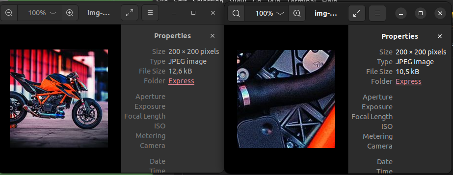

### update thứ 2 10/3
- withoutReduction: true => do not scale down image to fit more content
  

- withoutEnlargement: true => do not scale up image to fit less content,
don't modify base width and height